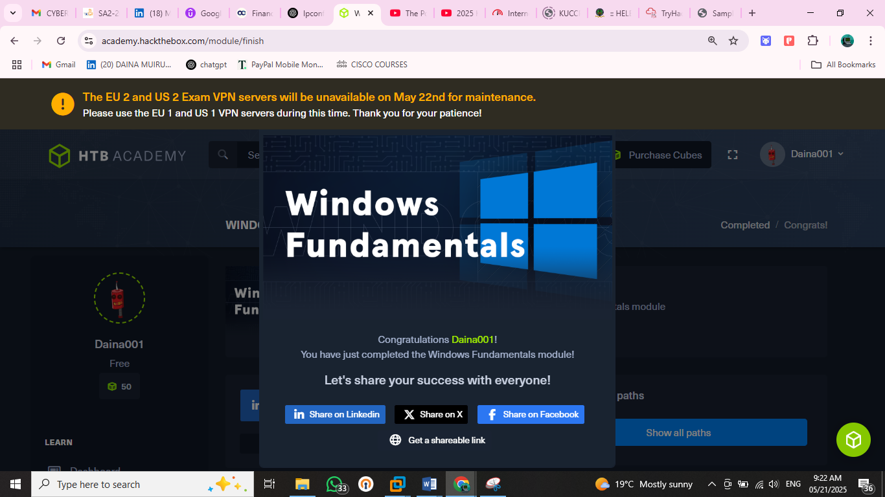
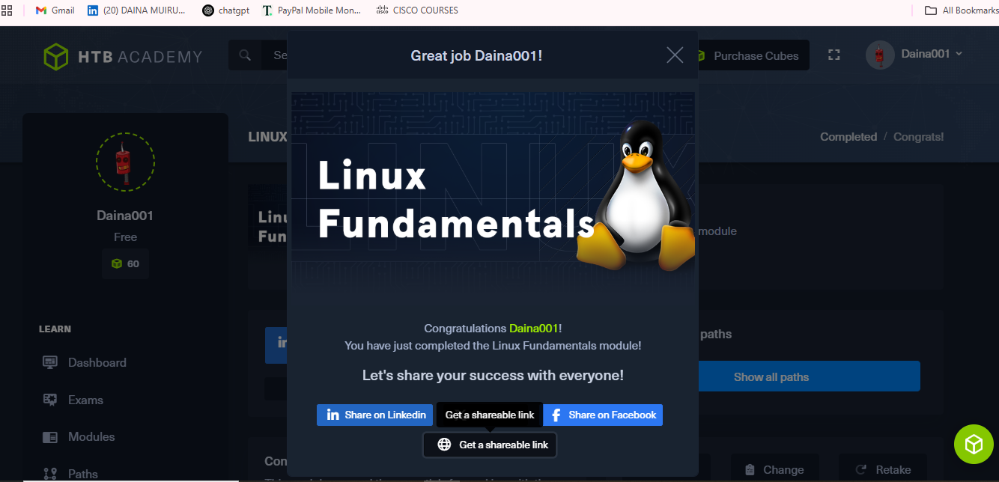
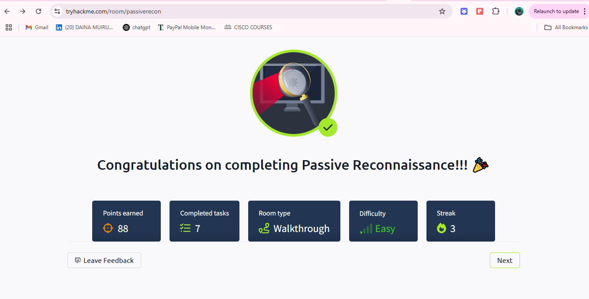

  

  


# **Daina Muiruri**  
**ICT Support Specialist | Web Developer | Security Analyst Enthusiast**

---

## 📄 Resume

### 🎓 Academic Background
**BSc Information Technology** – Taita Taveta University (2018 – 2023)  
*Second Class Honors (Upper Division)*

---

### 💼 Work Experience

**ICT Support Specialist** – SLIP Limited (May 2024 – Feb 2025)  
- Trained 50+ users across 10+ companies  
- Led troubleshooting, ticket resolution, and feature onboarding  
- Analyzed logs, escalated issues, and maintained support SLAs

**ERP Consultant** – Softiq Technologies (Mar 2024 – May 2024)  
- Implemented and supported ERP systems  
- Conducted user training and managed technical support

**Intern (ICT)** – Voi Library (Apr 2022 – Jun 2022)  
- Conducted stock taking, configured systems, supported users  
- Installed NVDA for visually impaired users

**Data Validation Clerk** – AC Nielsen (Jun 2019 – Jul 2019)  
- Handled market research data for brands like Coca-Cola, P&G

---

### 🏆 Certifications
- Virtual Assistant - ALX
- Cybersecurity Fundamentals – IBM
- Introduction to Cyber Security – Cisco
- Cyber Awareness – HP Life
- Information System Auditing & Assurance


---

### 🛠️ Skills

**Technical:**  
HTML, CSS, JavaScript, Python, Django, Git/GitHub, Odoo, Microsoft Dynamics, ERP, Office 365

**Soft Skills:**  
Analytical Thinking, Teamwork, Communication, Project Management, Time Management

---

## 🧪 Lab Challenges

---

### 🪟 HTB - Windows Fundamentals
**Platform:** Hack The Box Academy  
**Challenge:** Windows Fundamentals Module  
**Link:** [Completed Module Certificate](https://academy.hackthebox.com/achievement/1918160/49)

---

### 🧩 Problem Statement

This lab aimed to reinforce best practices in securing, managing, and auditing Windows systems via command-line tools. Tasks included identifying system build information, locating non-standard files, inspecting user permissions, and managing shared resources and services.

---

### 🛠️ Approach & Tools Used

- ✅ **System Info**: Used `Get-WmiObject` and `Get-CimInstance` to retrieve the **build number** and **Windows version**
- 📁 **Directory Enumeration**: Used `Get-ChildItem` to scan the C:\ drive for **non-standard directories**
- 🔐 **Permissions Check**: Employed `icacls` to determine which users had **full control** over directories like `C:\Users`
- 🌐 **Network Protocols**: Referred to training notes to identify **SMB (Server Message Block)** as the network file-sharing protocol
- 📊 **System Logs**: Confirmed **Event Viewer** as the default log viewer utility
- 📂 **Shared Directory**: Created and managed a shared folder called **Company Data**
- 🧪 **Service Auditing**: Used `Get-WmiObject Win32_Service` to identify **non-standard services**
- 🧾 **Aliases**: Discovered the alias for `ipconfig.exe` was `ifconfig`
- 🔒 **Execution Policy**: Checked using `Get-ExecutionPolicy –List`
- 🔐 **User Management**: Used `wmic` and `New-LocalUser` to identify SIDs for custom users and security groups

---

### 🧪 Key Commands Used

```powershell
Get-WmiObject –Class win32_OperatingSystem | select Version, BuildNumber
(Get-CimInstance Win32_OperatingSystem).Caption
Get-ChildItem -Path C:\ -Directory
icacls C:\Users
Get-Alias | Where-Object { $_.Definition -like "*ipconfig*" }
Get-ExecutionPolicy –List
wmic useraccount get name,sid
New-LocalUser -Name "Jim" –NoPassword
(Get-LocalUser -Name "Jim").SID.Value

### 📸 Screenshot


---

---

### 💻 HTB - Linux Fundamentals
- **Problem:** Learn basic Linux command-line operations and system structure for navigating, managing, and analyzing Linux environments
- **Approach:** Used shell commands to view system info, manage files/directories, inspect services, users, and packages; analyzed logs, inodes, and permissions; practiced starting web servers
- **Tools:** uname, echo, ls, find, ps, useradd, usermod, systemctl, curl, php, npm, fdisk
- **Lessons:** Gained confidence with Linux shell usage, user and service management, permission handling, and command-line networking. Learned practical skills for real-world penetration testing and system administration  

### 📸 Screenshot


---

---
 ### 🛰️ - Passive Reconnaissance
- **Problem:** Gather publicly available information about a target without direct interaction
- **Approach:** Used CLI tools (whois, nslookup, dig) and online services (DNSDumpster, Shodan.io) to extract DNS records, server data, and registration info
- **Tools:** whois, nslookup, dig, DNSDumpster, Shodan.io
- **Lessons:** Learned to differentiate between active and passive recon, query WHOIS/TXT/MX records, identify subdomains, and analyze exposed services without touching the target directly

### 📸 Screenshot


---

---

### 💻 HTB - DNS in Details

- **Problem: **Understand and analyze DNS record types, domain hierarchy, and DNS request behaviors
- **Approach:** Studied DNS structure (TLDs, subdomains), queried DNS records (A, AAAA, CNAME, MX, TXT) using practical tools in the TryHackMe lab environment
- **Tools:** DNS lookup interface, TryHackMe DNS simulator
- **Lessons:** Learned how to retrieve IP addresses, email server info, CNAME chains, and domain verification data using DNS queries

### 📸 Screenshot


---

## 📬 Contact

- 📧 **Email:** [daina.muiruri@gmail.com](mailto:daina.muiruri@gmail.com)  
- 📞 **Phone:** +254 795 551 432  
- 💼 **LinkedIn:** [linkedin.com/in/daina-muiruri-0154b81a3](https://www.linkedin.com/in/daina-muiruri-0154b81a3/)  
- 💻 **GitHub:** [github.com/DAINAWAMBUI](https://github.com/DAINAWAMBUI)

---

© 2025 Daina Muiruri. All Rights Reserved.
